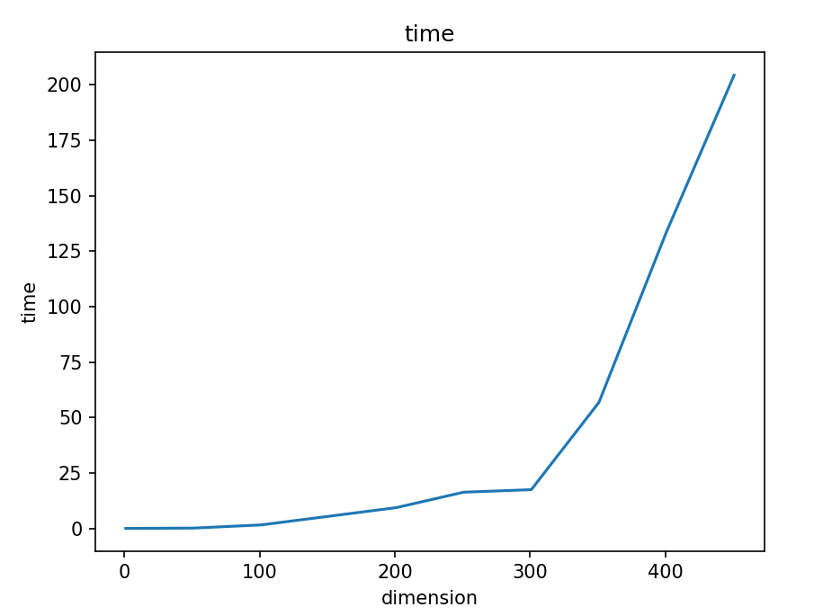
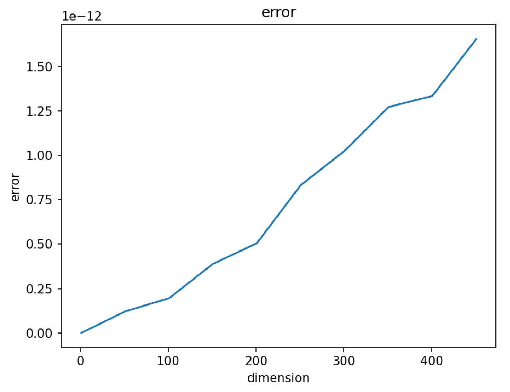
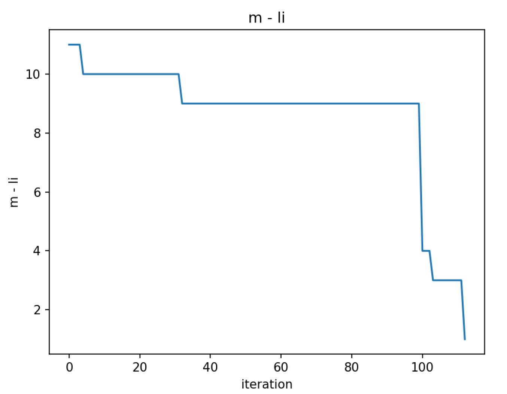

# 求对称实矩阵特征值与特征向量的QR方法实现


## Part 1：算法概要

该算法使用QR分解的迭代方法来计算对称实矩阵的特征值和特征向量。整个算法可以分为以下几个步骤：

1. 三对角分解：首先，通过Householder变换将输入矩阵转化为三对角形式。这个过程涉及到对矩阵的每一列应用Householder变换，使得除了主对角线和次对角线上的元素外，其他元素都变为零。同时，记录每次变换的正交矩阵Q，最终得到一个三对角矩阵和一个累积的正交矩阵Q。
2. 收敛判断：检查矩阵是否已经收敛到所需的精度。判断的方法是比较次对角线上的元素与主对角线元素的大小。如果次对角线元素足够接近于零，算法可以认为矩阵已经收敛。否则对其应用QR迭代。
3. QR迭代：接下来，使用Givens旋转来迭代三对角矩阵，使其逐步趋近于对角矩阵。Givens旋转是一种二维平面旋转操作，可以将矩阵的某两个非对角元素置为零。通过反复应用Givens旋转，我们可以将三对角矩阵迭代为更接近对角矩阵的形式。在迭代的过程中，记录每次旋转的Givens矩阵，最终得到迭代后的三对角矩阵和累积的Givens旋转矩阵G。
4. 迭代终止或继续：如果矩阵已经收敛，算法返回最终得到的三对角矩阵和累积的正交矩阵Q作为结果。否则，算法将继续迭代，重复步骤2和步骤3，直到达到最大迭代次数或矩阵收敛。

总体而言，该算法通过将对称实矩阵转化为三对角形式，并使用QR迭代过程将三对角矩阵迭代为对角矩阵的形式，从而计算出对称实矩阵的特征值和特征向量。通过迭代的方式，算法可以逐步提高结果的精度，直到满足收敛条件或达到最大迭代次数为止。


## Part 2：代码框架与说明

```py
import numpy as np
from utils import *


class symmetric_QR():
    def __init__(self, max_iter=1000, epsilon=1e-6):
        self.max_iter = max_iter
        self.epsilon = epsilon

    def __call__(self, matrix):
        self.matrix = matrix
        T, Q = self.full_QR()
        self.T = T
        self.Q = Q
        return T, Q

    # based on householder
    def tridiagnal_decomposition(self, matrix):
        n = matrix.shape[0]
        Q = np.eye(n)

        for k in range(1, n-1):
            x = matrix[k:, k - 1].copy()
            v, beta = householder(np.squeeze(x))
            H = np.eye(n)
            H[k:, k:] = np.eye(n - k) - beta * np.outer(v, v)
            u = beta * np.dot(matrix[k:, k:], v)
            w = u - beta * np.dot(u, v) * v / 2
            matrix[k, k - 1] = np.linalg.norm(matrix[k:, k - 1])
            matrix[k - 1, k] = matrix[k, k - 1]
            matrix[k:, k:] -= (np.outer(v, w) + np.outer(w, v))
            Q = np.dot(Q, H)
        matrix = make_tridiagnal(matrix)
        return matrix, Q

    def QR_iteration(self, matrix):
        n = matrix.shape[0]
        d = (matrix[n - 2, n - 2] - matrix[n - 1, n - 1]) / 2
        u = matrix[n - 1, n - 1] - matrix[n - 1, n - 2] ** 2 / (d + np.sign(d) * np.sqrt(d ** 2 + matrix[n - 1, n - 2] ** 2))
        x = matrix[0, 0] - u
        z = matrix[1, 0]
        G_total = np.eye(n)
        for k in range(1, n):
            c, s = givens(x, z)
            G = givens_matrix(c, s, k - 1, k, n)
            matrix = np.dot(G, np.dot(matrix, G.T))
            matrix = clean_the_errors(matrix, self.epsilon)
            if k < n - 1:
                x = matrix[k, k - 1]
                z = matrix[k + 1, k - 1]
            G_total = np.dot(G, G_total)
        return matrix, G_total

    def converge_deter(self, matrix):
        n = matrix.shape[0]
        for i in range(n - 1):
            if abs(matrix[i + 1, i]) <= self.epsilon * (abs(matrix[i, i]) + abs(matrix[i + 1, i + 1])):
                matrix[i + 1, i], matrix[i, i + 1] = 0, 0
        m = n
        li = -1
        while matrix[m - 2, m - 1] == 0 and m > 0:
            m -= 1

        if m == 1:
            m -= 1

        while ~ np.all(np.diag(matrix[li + 1:m, li + 1:m], k=1) != 0):
            li += 1

        if m == (li + 1):
            return True, m, li
        else:
            return False, m, li

    def full_QR(self):
        matrix = self.matrix
        n = matrix.shape[0]
        T, Q = self.tridiagnal_decomposition(matrix)
        for _ in range(self.max_iter):
            judge, m, li = self.converge_deter(T)
            if judge:
                return T, Q
            T[li + 1:m + 1, li + 1:m + 1], G = self.QR_iteration(T[li + 1:m + 1, li + 1:m + 1])
            G_full = np.eye(n)
            G_full[li + 1:m + 1, li + 1:m + 1] = G
            Q = np.dot(Q, G_full.T)
        return T, Q

```

这段代码实现了求解对称实矩阵的特征值和特征向量的过程，它基于QR分解的迭代方法。下面是代码的结构和算法细节的总结：

1. `__init__(self, max_iter=1000, epsilon=1e-6)`: 初始化函数，其中`max_iter`表示最大迭代次数，`epsilon`表示收敛判据的阈值。

2. `tridiagnal_decomposition(self, matrix)`: 对矩阵进行三对角分解，使用Householder变换将矩阵转化为三对角形式。返回三对角矩阵和正交矩阵Q。

3. `QR_iteration(self, matrix)`: 进行QR迭代过程，通过Givens旋转将三对角矩阵迭代为更接近对角矩阵的形式。返回迭代后的三对角矩阵和累积的Givens旋转矩阵G。下面是`QR_iteration`函数的算法细节解释：

   1. 初始化：获取矩阵的大小 `n`。然后计算矩阵最后两个对角元素的差值 `d`，以及一个中间变量 `u`，它是最后一个对角元素减去倒数第二个对角元素平方除以一个修正项。

   2. 设置初始值：定义两个初始变量 `x` 和 `z`。`x` 的值为矩阵的第一个对角元素减去 `u`，`z` 的值为矩阵的第二个对角元素。

   3. 迭代过程：使用 Givens 旋转进行迭代。对于每个 `k`（从 1 到 `n-1`），执行以下步骤：
      - 计算 Givens 旋转的参数：使用函数 `givens` 计算旋转的参数 `c` 和 `s`。
      - 生成 Givens 旋转矩阵 `G`：使用函数 `givens_matrix` 生成 Givens 旋转矩阵，该矩阵作用在 `k-1` 行和 `k` 行上，并且是一个 `n`x`n` 的正交矩阵。
      - 更新矩阵：将矩阵 `matrix` 进行 Givens 旋转变换，得到新的矩阵 `matrix`。
      - 清除误差：使用函数 `clean_the_errors` 清除矩阵中的近似误差，以确保矩阵保持对称性和三对角形式。
      - 更新 `x` 和 `z` 的值：如果 `k` 小于 `n-1`，更新 `x` 和 `z` 的值为矩阵的第 `k` 行和第 `k+1` 行的对角元素。
      - 累积 Givens 旋转矩阵：将当前的 Givens 旋转矩阵 `G` 与累积的 Givens 旋转矩阵 `G_total` 相乘，得到更新后的 `G_total`。

   4. 返回结果：返回迭代后得到的矩阵 `matrix`，以及累积的 Givens 旋转矩阵 `G_total`。

   总体上，`QR_iteration` 函数通过使用 Givens 旋转将矩阵迭代为更接近对角矩阵的形式，其中每次迭代都会更新矩阵和 Givens 旋转矩阵。通过迭代过程的重复，矩阵逐渐收敛到一个三对角矩阵，同时累积的 Givens 旋转矩阵 `G_total` 记录了所有的旋转操作。最终，返回迭代后得到的矩阵和累积的 Givens 旋转矩阵作为结果。

4. `converge_deter(self, matrix)`: 判断矩阵是否收敛，即检查矩阵的次对角线元素是否足够接近于零。返回一个布尔值、右下角对角矩阵的起始坐标m和第不可约三对角子阵的索引li。

5. `full_QR(self)`: 完整的QR迭代过程，包括对矩阵进行三对角分解和迭代QR过程。在每次迭代中检查矩阵是否收敛，如果收敛则返回最终得到的三对角矩阵和累积的正交矩阵Q。

需要注意的是，代码中使用了一些辅助函数，如`householder`、`givens`和`givens_matrix`，这些函数可能在`utils`模块中实现。这些函数的具体实现细节不在代码中显示，但它们在QR迭代过程中起到了关键作用。


## Part 3：对于运行效率、误差、收敛性能的一些分析

首先我们对1到500阶的对称矩阵分别运用QR算法并记录时间绘图如下：




同时，我们分别测出||A - QTQ' ||的值作为误差分析如下：




可见其性能良好，误差较小，复杂度基本在O(n^3)的程度。

同时，下面是8阶矩阵的收敛效果：



可见收敛性能也是良好的。
